# MS3: Tips.

[View the live project here.](https://adamdelancey.github.io/ms3-tips/)

As my submission for the Code Institute Milestone Project 3, this Tips website is a site where users can create, read, update and delete suggestion of things to do in Stockholm,
for example where to eat and drink, in order to create a database of ideas that locals and tourists can use to maximise their experience in the city.It is designed to be 
responsive and accessible on a range of devices, making it interactive and easy to navigate for potential users.

<p align="center">
    

# Access

View the project live: [here](https://ms3-tips.herokuapp.com/)

View the Github repo: [here](https://github.com/adamdelancey/ms3-tips)

## Contents

- [UX](#ux)
    - [Strategy](#strategy)
        - [Business Objectives](#business-objectives)
        - [User Stories](#user-stories)
            - [First Time Visitor Goals](#first-time-visitor-goals)
            - [Frequent User  Goals](#frequent-user-goals)
    - [Scope](#scope)
        - [Current Features](#current-features)
            - [Navbar](#navbar)
            - [Back to top Button](#back-to-top-button)
            - [Home Page](#home-page)
            - [Property Landing Page](#property-landing-page)
            - [Property Listing Page](#property-listing-page)
            - [Contact Page](#contact-page)
        - [Long-term goals](#long-term-goals)
    - [Structure](#structure)
    - [Skeleton](#skeleton)
        - [Wireframes](#wireframes)
    - [Surface](#surface)
        - [Design](#design)
            - [Colour Scheme](#colour-scheme)
            - [Typography](#typography)
            - [Imagery](#imagery)
            - [Icons](#icons)
- [Accessibility](#accessibility)
    - [Alt Tags](#alt-tags)
    - [Forms](#forms)
- [Technologies used](#technologies-used)
    - [Languages Used](#languages-used)
    - [Frameworks, Libraries & Programs Used](#frameworks-libraries-&-programs-used)
- [Testing](#testing)
    - [Validation](#validation)
    - [Autoprefixer CSS Online](#autoprefixer-css-online)
    - [Lighthouse](#lighthouse)
    - [EmailJS API](#emailjs-api)
    - [Testing User Stories from User Experience Section](#testing-user-stories-from-user-experience-section)
    - [Fixed Bugs](#fixed-bugs)
    - [Further Testing](#further-testing)
- [Deployment](#deployment)
- [Credits](#credits)
- [Acknowledgements](#acknowledgements)


# UX

## Strategy

### Business Objectives

1. To create a space where all users, first-time or frequent, can find exciting and new things to do in Stockholm.
2. To create a site where users can add suggestions to the community and find others' suggestions to improve their experience.
3. To create a site that is used by locals and tourists alike to share ideas.
4. To create an exciting database that can be used for further research into life in Stockholm.

### User stories

-   #### First Time Visitor Goals

    As a First Time Visitor, I want to:

    1. Quickly understand the service being provided by Tips and how I can interact with the service.
    2. Be able to easily browse the various 'tips' in Stockholm and find something that interests me.
    3. Be able to register to the website and add my own 'tips'.
    4. Be able to comfortably navigate throughout the site between my own tips and other users'.
    5. Get an instant first-impression that this is a professional, modern and up-to-date site with good UX.

-   #### Frequent User Goals

    As a Frequent User, I want to:
    1. Easily be able to check if any new tips have been added that may interest me.
    2. Login to the account that I had previously set up and see my own submissions.
    3. Add more tips to the website that I may not have done already.
    4. Edit my own tips.
    5. Delete any tips that are no longer relevant.

-   #### Admin Goals

    As Admin, I want to:
    1. Be able to create, read, update and delete all tips on the site.

## Scope

### Current features

* Opening Page
    - Video background showing off Stockholm, using free video footage from [Pexels](https://www.pexels.com/video/timelapse-of-stockholm-at-night-852395/).
    I believe this gives a modern and professional first impression on the user.
    - Fading in text and buttons to enter the site. Acting in sync with the video mentioned above, this adds to the modern
    first impression and should make users excited to see more of the site.
    - This page hides the navbar and footer in order to keep the page to fit to the total size of the viewing window.

* Base HTML - on all pages
    - Navbar (Desktop) - an easy to use, modern design and minimal options to help the user navigate throughout the site 
    at all time. Using an if statement, the navbar changes whether the user is logged in or out, or is an admin.
    - Navbar (Mobile) - using Materialize, the mobile navbar is a slide option that is triggered by the hamburger icon 
    in the fixed navbar. This adds to the user experience and allows for easier navigation on mobile.
    - Flash messages - using the imported 'flash' feature from Flask, there are flash messages that appear on each page each 
    time the user interacts with the site by logging in or registering, logging out, adding a tip, editing a tip, and deleting a tip.
    - Footer - Simple social media icons to learn more about the company. As this is a fictional site and there are no actual 
    social media accounts, to the links simply go to the homepages on an external link in order for the user to still 
    stay in the Tips site.  

* Landing Page
    - Filter icons to see the different categories of Tips that are on offer - Eat, Drink, In, Out, Stay, and then an option 
    for All to see all options. These are labelled with a large icon to continue with the modern style and the filters allow 
    the user to see only the tips that they want to see.
    - Search bar - similarly, in order to improve user experience, there is a search bar that searches for either the name or 
    description of the Tip, in order for the user to find the desired Tip sooner. There is also then the option to 
    'reset' the page for if the user wants to return to seeing all the options.
    - Cards - by using the jinja templated for loop, each individual Tip is displayed within a Materialize card 
    feature, making it easy to see the image, category, name and short description. The picture can then be clicked on as 
    a link to find out more information about the Tip. Additionally, using the sort method in Python, the most recent 
    and therefore most likely relevant Tip is displayed first.


* Tip Page
    - A simple layout featuring a large image of the Tip, the category name, tip name, long description and the details of the 
    user that added or edited the tip. In addition there is a 'return to home' button which acts as an additional navigation 
    option for ease of use.     

* Login/Register Page 
    - A simple card design for each, with a form to add in the desired username and password. The username and password must be 
    alphanumerical and be of a length between 5 and 15 characters.

* Profile Page
    - Instead of a flash message, the user is welcomed by a message which includes their username over the background of an image 
    of Stockholm.
    - A button to 'Add a Tip' allowing quick user access to add an additional Tip of their choice.
    - Features the Tips that the user has already added. For these cards, in contrast to the cards on the landing page, the user 
    is able to read, update and delete the tip if they choose.
    - As part of defensive programming, the delete button is followed by a modal which asks the user if they are sure that they 
    want to delete the tip, in order to avoid any accidental deletions. 

* Add/Edit Tip Page
    - These both have a similar design in order to create a new tip or update an existing tip. Each entry into the form uses the 
    required attribute, and some have min and max values to ensure that the layout remains consistent. As well as text 
    entries, there is a date selection function to choose the date that the tip has been added, and extra JQuery has been added to ensure 
    that the category name is not left blank.

* Manage All Page
    - For the Admin user only, there is a Manage All button in the Navbar where the user is able to read, update and delete all Tips 
    added by any user
  

### Long-term goals

Future improvements to the website may include:

* Be able to add reviews to other user's tips and then allow the website to order user suggestions from best to worst.
* Expanding the website to be used across more cities around the world.
* Include a paid service so that hotels or experiences companies can advertise their business on the site.
* Pagination could be included to the Tips page in the case of many users adding their Tips to the site.


## Structure

* I made the decision to have the site split into clear sections rather than one page. For all users, different pages for the home, 
tips, login and register page. For a logged in user, the Profile and Edit tip page, and for the Admin, additionally the Manage All 
page. Each page has the same navbar and the adjusting Navbar to ensure consistency and ease of use across the site.


## Skeleton

### Wireframes

Desktop View
<p>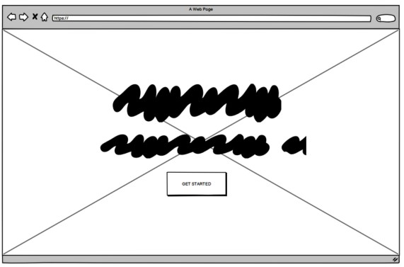
    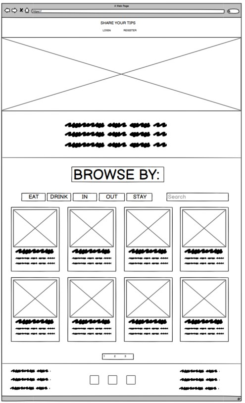    
    
    
    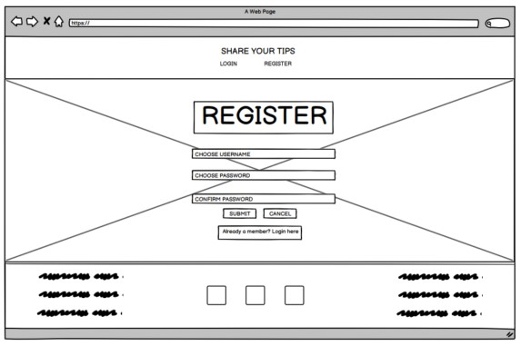</p>
    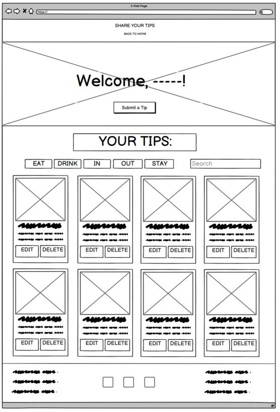</p>
    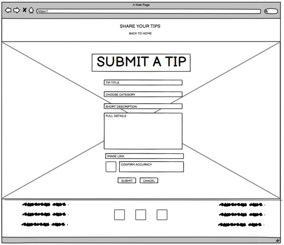</p>
    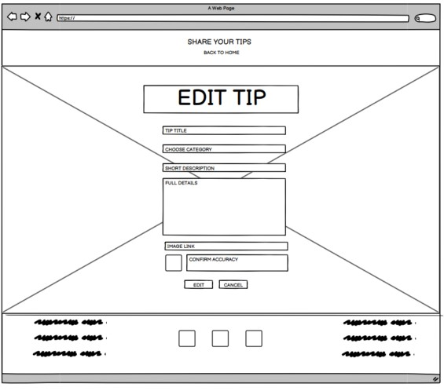</p>

Mobile & Tablet Pages
<p>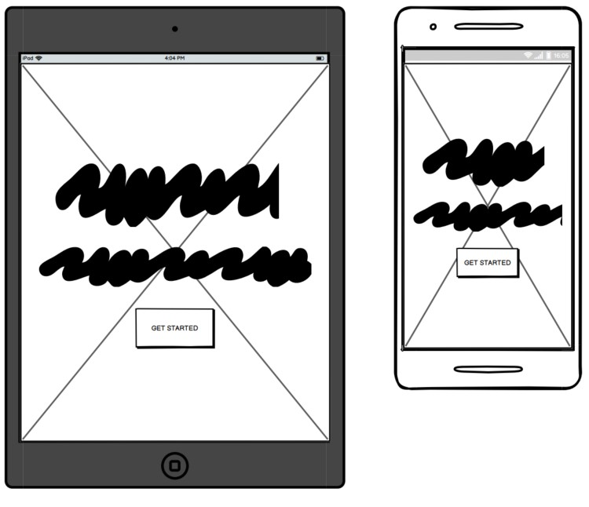
    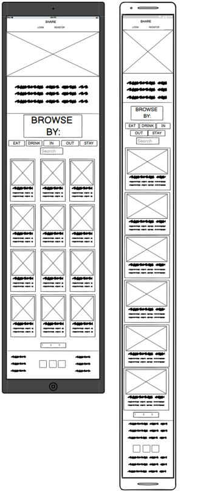    
    
    
    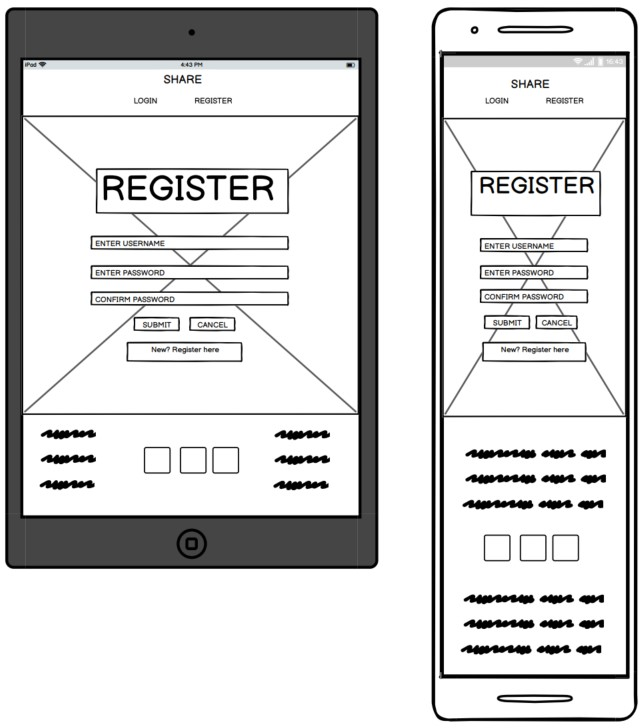</p>
    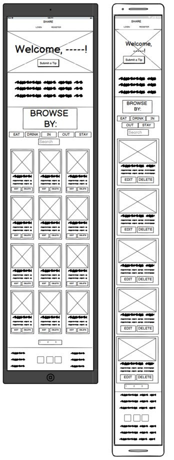</p>
    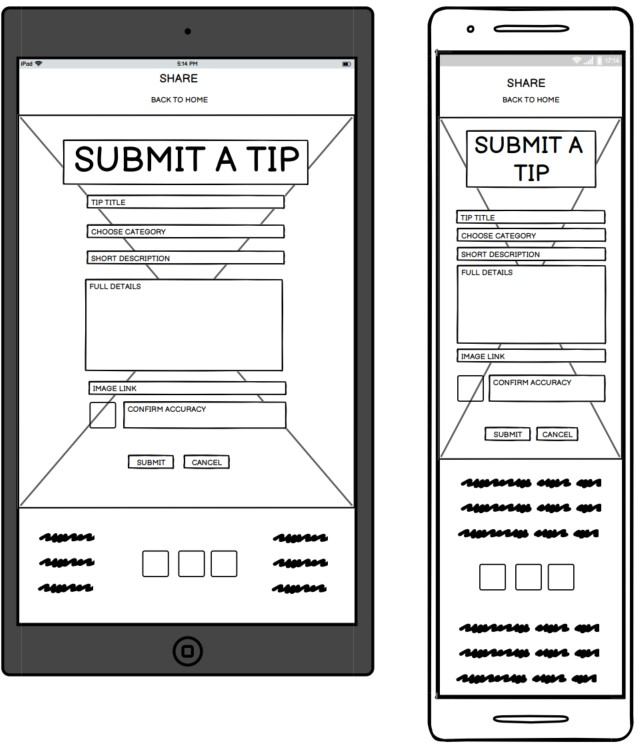</p>
    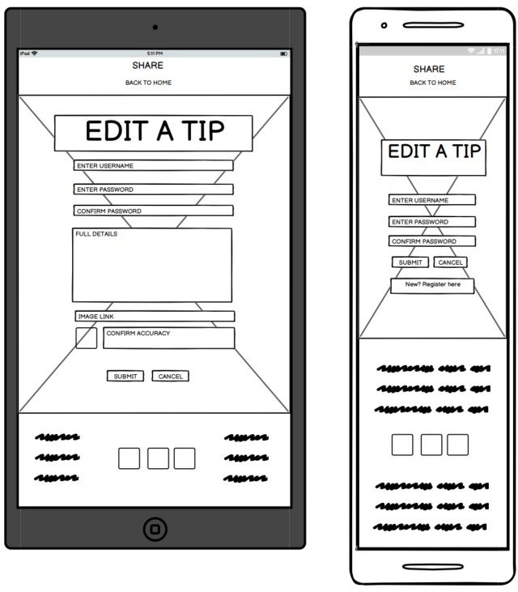</p>

Full wireframes can be accessed here:

-   Desktop Wireframes - [View](documentation/wireframes/tips-desktop.pdf)

-   Mobile & Tablet Wireframes - [View](documentation/wireframes/tips-tablet-mobile.pdf)    


## Surface
   
### Design
-   #### Colour Scheme
    <p>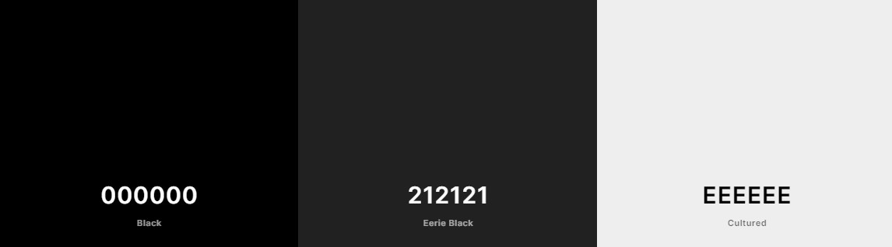</p>
    -   I have used a simple, clean and chromatic design for the colours used in the project. The black is mainly used for 
    the text, while the dark-grey colour (as featured in Materialize) is used for the navbar, buttons and footer. In contract, the 
    off-white "cultured" colour is used for the background on all pages in order for the photos and cards to be lifted forward. Due to the 
    images from the tips being colourful, I believe this simple design compliments this well.

-   #### Typography
    -   The Sarala font is the main font used throughout the whole website with Sans Serif as the fallback font in case 
    for any reason the font isn't being imported into the site correctly. I chose this as I believe it has a modern feel and 
    reflects the style of the remainder of the site. 

-   #### Imagery
    - The hero images and background images were all taken from [Pexels](https://www.pexels.com/). The images for the tips 
    are added via a link by the user. 
    - All photos were put through [Tiny PNG](https://tinypng.com/) to reduce the file size and improve loading time.

-   #### Icons
    -   The icons used throughout the site are taken from [Font Awesome](https://fontawesome.com/).

# Information Architecture

MongoDB Atlas is used for storing data for this web site.

Current schema:
A txt version can be viewed [here](documentation/data/data.txt)

<p>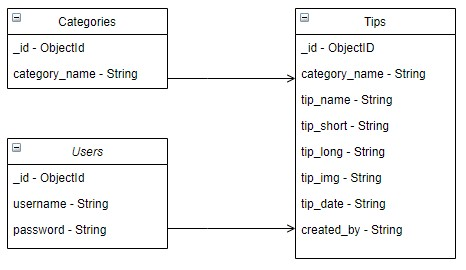</p>


For the needs of this website I did need to use other data types in MongoDB.

# Accessibility

## Alt Tags

In order to ensure that all images are accessible for those using a screen reader, I have ensured that all images used throughout the site include alt tags.

# Technologies used

## Languages Used

-   HTML5
-   CSS3
-   JavaScript
-   Python

## Frameworks, Libraries & Programs Used


1. [MongoDB](https://www.mongodb.com/1)
    - MongoDB was used to host the data used on the site and was chosen due to the non-relational nature of the data.
1. [Flask](https://flask.palletsprojects.com/en/1.1.x/)
    - The Flask framework was used to import the Flask, flash, render_template, redirect, request, session, and url_for 
    functions that are used throughout the site.
1. [BSon](http://bsonspec.org/)
    - This was imported in order to access the data used across the site.
1. [Werkzeug](https://werkzeug.palletsprojects.com/en/1.0.x/)
    - This was imported in order for the password control to enhance security on the site.
1. [Jinja Templating](https://jinja.palletsprojects.com/en/2.11.x/templates/)   
    - This was used predominantly for the with, for loops and if statements in order to display all of the relevant data.
1. [JQuery](https://jquery.com/)
    - I have used JQuery predominantly to initialise the components used in the Materialize framework. In addition, I used 
    code taken from the Data Centric Development Module with the Code Institute in order to ensure that the category names are 
    a required attribute.
1. [Materialize 1.0.0](https://materializecss.com/)
    - Materialize was used to assist with the responsiveness and styling of the website, such as the navbars for desktop and 
    mobile, buttons, forms, cards and colours.
1. [Google Fonts](https://fonts.google.com/)
    - Google fonts were used to import the 'Sarala' font which is used on all pages throughout the project.
1. [Font Awesome](https://fontawesome.com/)
    - Font Awesome was used on all pages throughout the website to add icons for aesthetic and UX purposes. 
1. [Git](https://git-scm.com/)
    - Git was used for version control by utilising the Gitpod terminal to commit to Git and Push to GitHub.
1. [GitHub](https://github.com/)
    - GitHub is used to store the projects code after being pushed from Git.
1. [Heroku](https://dashboard.heroku.com/apps)
    - Heroku is used for the hosting of the site and is deployed through here.
1. [Balsamic](https://balsamiq.com/)
    - Balsamiq was used to create the wireframes during the design process.

# Testing

## Validation

The W3C Markup and CSS Validator Services, JSHint and Python Validator were used to validate every page of the project 
to ensure there were no syntax errors in the project.

-   [W3C Markup Validator](https://validator.w3.org/) - [Results](https://validator.w3.org/nu/?doc=https%3A%2F%2Fms3-tips.herokuapp.com%2F)
    This same result appears across every page of the site.
    <p> 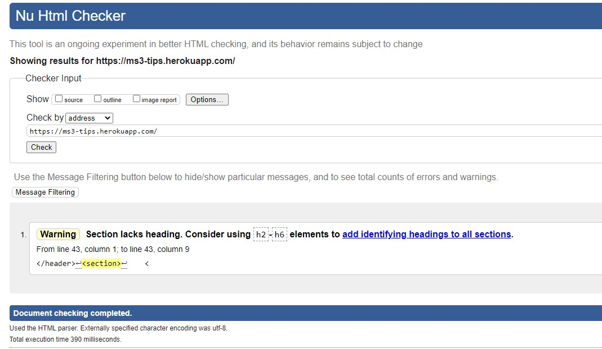  </p> 
-   [W3C CSS Validator](https://jigsaw.w3.org/css-validator/) - [Results](https://jigsaw.w3.org/css-validator/validator?uri=https%3A%2F%2Fms3-tips.herokuapp.com%2F&profile=css3svg&usermedium=all&warning=1&vextwarning=&lang=en) -  
    There is 1 property issue found when checking the site. However, these are being validated from the Materialize 
    link and therefore out of my control.
    <p> 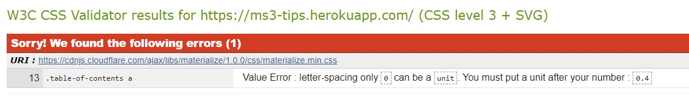  </p> 
-   [JSHint](https://jshint.com/) - 
    No issues were found on this check.
    <p> 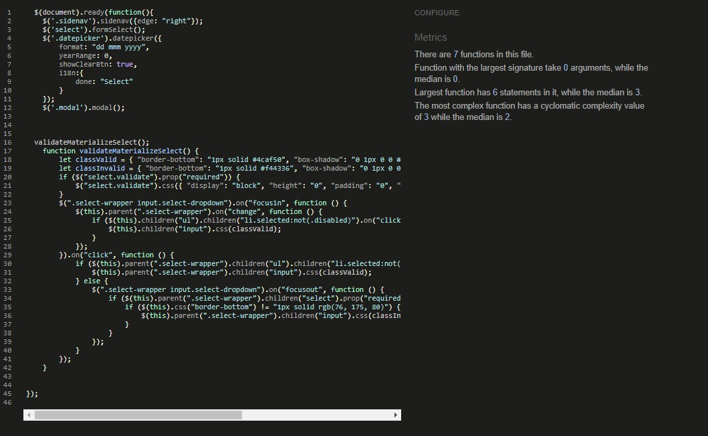</p>      
-   [Python Validator](http://pep8online.com/)
    No issues were found on this check.
    <p> 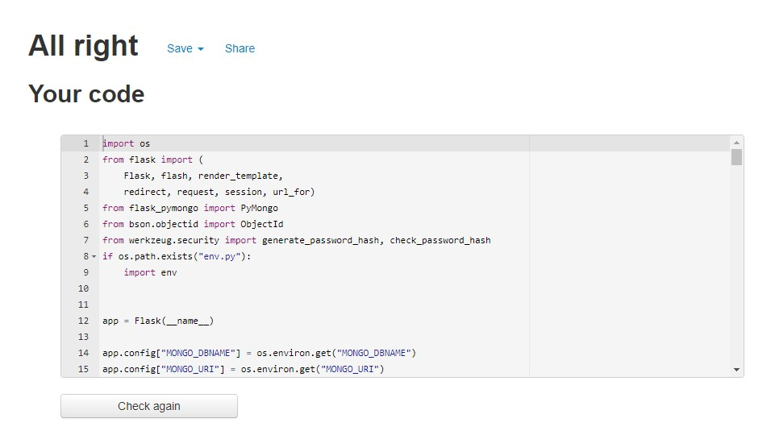</p>   
    

## Autoprefixer CSS Online

This was used to parse CSS and add vendor prefixes in order to ensure that the CSS styling works properly across all 
browsers. I have added the below header to my CSS styles sheet in order to show this:
<p> 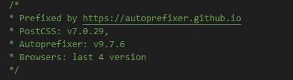  </p>

## Lighthouse

<p >Desktop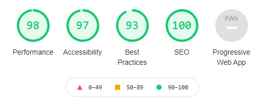
Mobile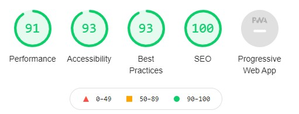</p>

From Chrome Developer Tools, this Lighthouse score is based on the homepage while being viewed on desktop and mobile. The biggest variant
throughout the site is the performance score, which is predominantly due to the image link added by users to the site for each individual 
tip, making it quite hard to control. 


## Testing User Stories from User Experience Section

-   #### First Time Visitor Goals - I want to:

    1. Quickly understand the service being provided by Tips and how I can interact with the service.
        - *Upon loading the page the user presented with a short looped video on Stockholm, as well as the simple page slogan of 'Do 
        What the Locals Do.' Next, on the Tips landing page, there is a short description which tells the user exactly what the website 
        is about and how they can interact. In addition, the dynamic and easy to understand navbar helps the user to interact easily.*

    2. Be able to easily browse the various 'tips' in Stockholm and find something that interests me.
        - *As you can see below, large icon buttons are presented to user to be able to filter their results immediately into the main 
        categories of eat, drink, in, out and stay. Additionally, there is a search bar to help the user find the desired result*
        <p>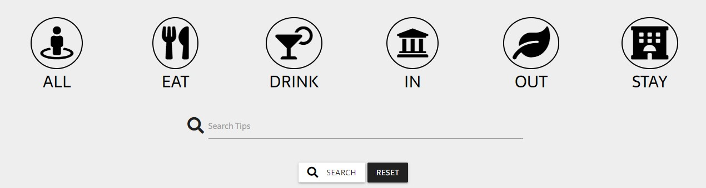</p>

    3. Be able to register to the website and add my own 'tips'.
        - *Upon entering the landing page, the user is able to either login to an existing account or register to the website. From here, 
        they are redirected to their own profile page, where they can add their own tips, as well as edit and delete existing ones.*
    4. Be able to comfortably navigate throughout the site between my own tips and other users'.
        - *On the initial page, it is only possible to view all the tips. However, on the profile page, the user is presented with the 
        tips that they have added under 'Your Tips.' From here, there is the additional feature on the cards of edit and delete*
        <p>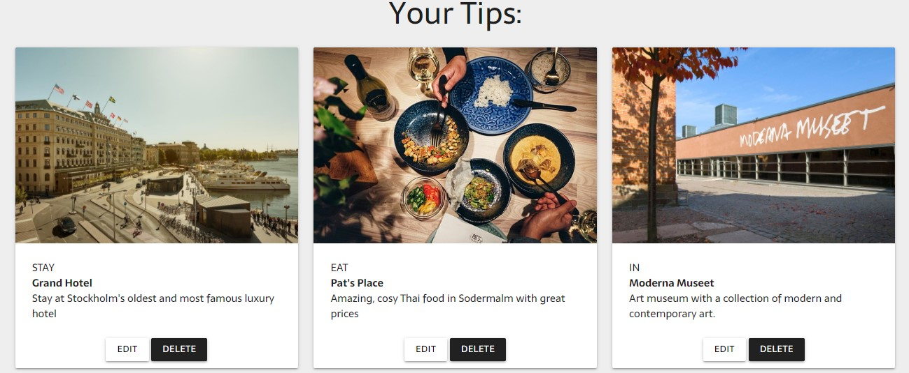</p>
    5. Get an instant first-impression that this is a professional, modern and up-to-date site with good UX.
        - *By adding the short full-screen video on the page that is first loaded, I believe that this creates the desired effect.*


-   #### Frequent User Goals - I want to:

    1. Easily be able to check if any new tips have been added that may interest me.
        - *The main tips landing page, as well as the filtered pages, or all sorted by the order of which they were added to the site. 
        Therefore, any new tip that the user has not seen before will be viewed at the top of the page immediately, making them easy to find.*
    2. Login to the account that I had previously set up and see my own submissions.
        - *On the same page, on the navbar, there is the option to login, which redirects the user to their own profile page where they can 
        see the tips that they have previously submitted.*
    3. Add more tips to the website that I may not have done already.
        - *On their profile page, there is an 'Add A Tip' button near the tip of the page, which allows the user to add their own. *
    4. Edit my own tips.
        - *As mentioned previously, on the user's profile page there is an edit button where they can edit their own tip.*
    5. Delete any tips that are no longer relevant.
        - *Similarly, they can delete their own tips. With defensive programming in mind, if the user clicks delete then a modal appears 
        asking the user if they are sure that they want to delete the tip, which will then permanently remove it.*
        <p>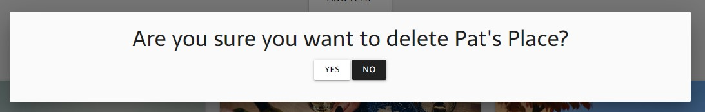</p>


-   #### Admin Goals - I want to:
   
    1. Be able to create, read, update and delete all tips on the site.
        - *If the admin logs into their 'admin' account, then they have a new option in the navbar - Manage All. This allows the user to 
        see all of the available tips and edit and delete them as their choosing. Using jinja templating, I have ensured that this page 
        is only available to view if the user logged in as the admin, therefore avoiding other users forcing their way onto the page. 
        If not, the following error appears:* 
        <p>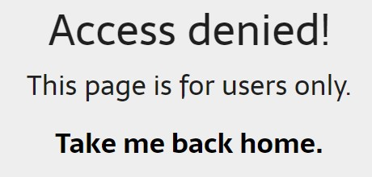</p>

        *Addionally, once edited, every user will then know that the tip has been amended by the admin to reflect that the most 
        updated version was created by the admin, not the user. This then appears as:*
        <p>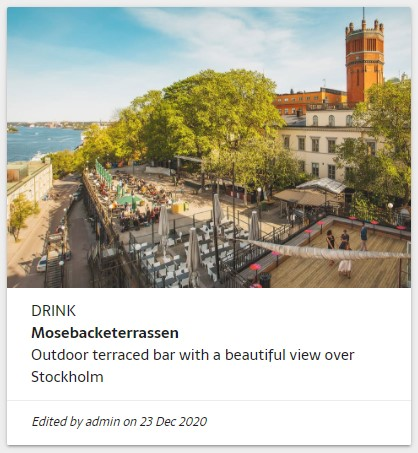</p>


## Fixed Bugs
After deployment, I found multiple bugs that needed addressing:

1. When deleting a tip using the modal feature, the site deleted the first tip in the list, as opposed to the one that was clicked on.
    - *Having recognised that when using the for loops for the modal, the ID is always the same, I amended the ID to read "modal{{loop.index}}". 
    This ensures that the correct tip is deleted.*
2.  When clicking the different filter buttons, the page loads to the top each time, which is quite annoying for the user. 
    - *I amended the href to "{{ url_for('tips') }}#list" and added the same #list id to that div. This works much better for 
    functionality.*  
3.  My filter_tips function in app.py was not working succesfully. The function was printing the correct category names from the database, 
but it wasn't loading the correct items properly. 
    - *Having realised the problem must be on the front end, I realised that the issue was that I was using a different variable name 
    in my filter_tips function compared to the tips function. I therefore then amended the loops on the HTML page to category, to match 
    both variables, and it worked.*


## Further Testing

- Each link and paticularly aspects of the CRUD functionalities have been tested across the site to ensure everything was 
working correctly.
- Throughout the development process, I used the Chrome Developer Tools, specifically by using the print() function to test 
Python code, as well as for the various CSS designs, particularly around responsiveness.
- The website has been tested on various desktop browsers such as Google Chrome, Firefox, Safari and Edge, as mentioned above, I used 
the CSS tool Autoprefixer Online to help with this. 
- Friends and family were also asked for advice particularly on layout and in order to ensure that the site was being tested across 
various devices. 


# Deployment

Tips was developed using GitPod, using Git and GitHub to host the repository.

## Cloning Tips from GitHub ##

Ensure you have the following installed:

- [PIP](https://pypi.org/project/pip/)
- [Python 3](https://www.python.org/)
- [Git](https://git-scm.com/)
- [Heroku CLI](https://devcenter.heroku.com/articles/heroku-cli)

In addition, create an account on [MongoDB](https://www.mongodb.com/) in order to create the database.

1. Clone the repository by either downloading from [source](https://github.com/adamdelancey/ms3-tips), or if you have Git installed 
typing the following command into your terminal:

```bash
git clone https://github.com/adamdelancey/ms3-tips
```

2. Navigate to this folder in your terminal window and install the required modules to run the application using the following command:

```bash
python -m pip -r requirements.txt
```

3. Initialise the virtual environment by typing the following command into the terminal:

```
py -m venv virtual
```

4. In MongoDB, create a new database called *tips* with three collections: categories, tips and users.

5. Back in GitPod create a file to hold your environment variables and call it env.py.

6. Your env.py file should contain the following:

```
import os

os.environ.setdefault("IP", "0.0.0.0")
os.environ.setdefault("PORT", "5000")
os.environ.setdefault("SECRET_KEY", "YOUR_SECRET_KEY")
os.environ.setdefault("MONGO_URI", "YOUR_MONGODB_URI")
os.environ.setdefault("MONGO_DBNAME", "YOUR_DATABASE_NAME")
os.environ.setdefault("DEBUG", "1")
```

- Make make sure you update your the secret keys and passwords.

- Before pushing the project to a public repository, add your env.py file to .gitignore.

7. You can now run your application locally by typing the following command into your terminal:

```
python run.py
```

## Deploying Tips to Heroku ##

1. Log in to Heroku and click create new app.

2. Create a requirements.txt file using the following command in GitPod:

```
pip3 freeze --local > requirements.txt
```

3. Create a Procfile with the following command:

```
echo web: python run.py > Procfile
```

4. Push these newly created files to your repository master.

5. Add heroku remote to your git repository by getting the heroku git URL from the heroku account settings. Then type the following: 

```
git remote add heroku https://git.heroku.com/xxxxx
```

6. Push the page to your heroku account:

```
git push heroku master
```

7. In your heroku app, set the following variables:

Key|Value
:-----:|:-----:
HOSTNAME|0.0.0.0
PORT|5000
MONGO_URI|YOUR_MONGODB_URI
SECRET_KEY|YOUR_SECRET_KEY

  ** Please make sure you enter your own *SECRET_KEY*, and *MONGO_URL*.

8. Click the deploy button on the Heroku dashboard.
9. The site has been deployed to Heroku.


# Credits

- All professional images have been sourced from a combination of [Unsplash](https://unsplash.com/s/photos/bristol) and [Pixabay](https://pixabay.com/).
- All photos related to the properties have been sourced from Ash Tree Estates.
- The Navbar, Forms, Carousels and Cards have been chosen from Bootstrap templates and adapted using CSS.
- Initial instructions for setting up the Google Maps API were taken from the relevant lesson from the [Code Institute](https://codeinstitute.net/).
- Similarly, setting up the EmailJS API was also taken from the relevant lesson from the [Code Institute](https://codeinstitute.net/).
- Instructions for setting up the getNearbyPlaces function was taken from the [Google Codelabs Developer lessons](https://codelabs.developers.google.com/codelabs/google-maps-nearby-search-js#1)
- [Stack Overflow](https://stackoverflow.com/) and [W3C Schools](https://www.w3schools.com/) were used for occasional debugging or issues where I could not initially work out the solution myself.
- Fonts are from [Google Fonts](https://fonts.google.com/) and icons from [Font Awesome](https://fontawesome.com/).


# Acknowledgements

- My mentor, Aaron Sinnott, for his support and mentorship during the project.
- The peer-code-review channel on Slack and their trusty channel leads for both code and design tips.
- Friends and family for testing the site on their various devices.
